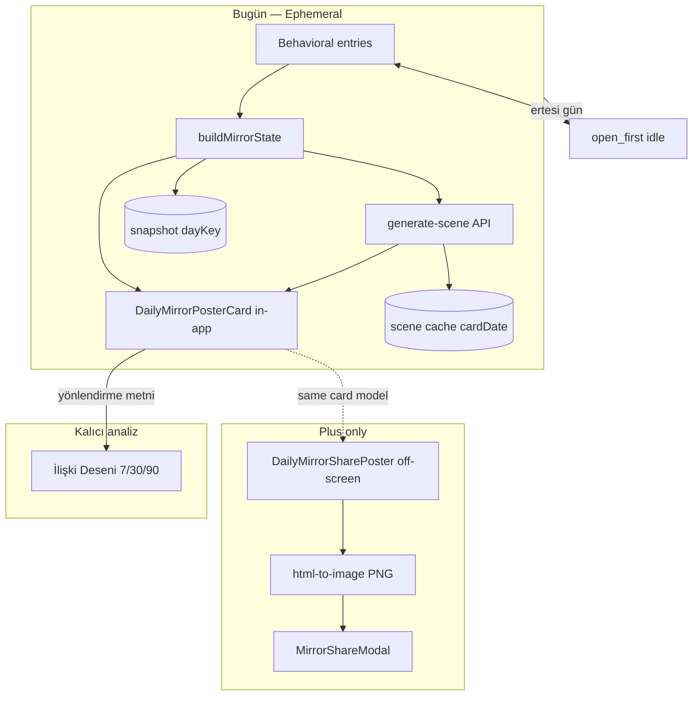

# EZA Daily Mirror — P4-D Access Rules + Premium Share Artifact

**Durum:** Ürün + teknik spec (onaylı yön)  
**Kapsam:** Frontend mirror UX; backend değişmez  
**Önceki analiz:** Ephemeral + share flow incelemesi (May 2026)

---

## 1. Ürün özeti

Daily Mirror artık **kalıcı bir geçmiş ekranı değildir**. Bugünün hikâyesi: günlük, geçici, paylaşılabilir bir ayna deneyimi.

| Yüzey | Rol |
|--------|-----|
| **AI Ayna (Günlük)** | Bugünün kartı; gece sıfırlanır |
| **AI İlişki Deseni** | 7 / 30 / 90 günlük kalıcı analiz |

**Yapılmayacak:** Timeline, Growth Story, Geçmiş Aynalar, günlük kart arşivi.

---

## 2. Ephemeral Daily Mirror

### Davranış

1. Kullanıcı bugün kart oluşturur.
2. Kart gün boyunca görünür (aynı gün tekrar girişte aynı kart / aynı veri snapshot’ı).
3. Ertesi gün kart **sıfırlanır**; dünkü kart geri çağrılmaz.
4. Kullanıcı kartı beğendiyse **paylaşır** veya **indirir** (Plus artefact).

### Teknik (mevcut + sağlamlaştırma)

| Mekanizma | Amaç |
|-----------|------|
| `eza_daily_mirror_snapshot` + `dayKey` | Gün içi “kart zaten oluşturuldu” |
| `readTodaysSnapshot()` | Ertesi gün `null` → `open_first` |
| `eza_daily_mirror_scene_v1` | Gün içi sahne URL önbelleği (`cardDate` + fingerprint) |
| `eza_mirror_style_lens_v1` | Gün içi Plus lens döngüsü (`dayKey` eşleşmesi) |

**P4-D ekleme:** `clearStaleDailyMirrorSnapshot()` — `dayKey !== bugün` kayıtları sil (storage şişmesi + edge case).

**Hydrate kuralı:** Yalnızca `refreshCta !== 'open_first'` ve bugünkü snapshot → kart rebuild; dünkü snapshot asla hydrate edilmez (mevcut kod doğru).

### Kullanıcı dili (ephemeral)

Birincil:

> Bugünkü aynan gece sıfırlanır. Beğendiysen paylaş veya indir.

İkincil (kart altı):

> Bu ayna bugün için oluşturuldu. Yarın yeni bir ayna açılır.

İlişki Deseni köprüsü:

> Zaman içindeki değişimini [AI İlişki Deseni](/standalone/mirror/pattern)’nde görebilirsin.

**Kaldırılacak / güncellenecek metinler:**

- `FREE_MIRROR_READY_PLUS_HINT` içindeki **“geçmiş aynalar”**
- Timeline / arşiv / “dünkü aynam” ima eden tüm UX copy

---

## 3. İki yüzey: Uygulama kartı vs Premium paylaşım posteri

### Prensip

| | Uygulama içi kart | Premium paylaşım posteri |
|--|-------------------|---------------------------|
| **Amaç** | Bugünü anlamak, okumak, ritim | Sosyal medyada paylaşılacak sinematik artefact |
| **Bileşen** | `DailyMirrorPosterCard` | `DailyMirrorSharePoster` |
| **DOM** | `data-mirror-card` (in-app root) | `data-mirror-share-root` |
| **İçerik** | Sahne + glass paneller, reflection, tomorrow, ritim whisper, skorlar (ürün kararına göre) | Sahne + masthead + `dailyAvatarName` + `mirrorMoment` + `dailyThemeTitle` + footer |
| **Görünürlük** | Her zaman in-app | Off-screen; export / modal preview |
| **Capture** | Fallback only | **Birincil** export hedefi (`resolveMirrorExportCaptureNode`) |

Paylaşım PNG / native share / indirme **yalnızca** share poster DOM’undan üretilir. In-app kart asla paylaşım çıktısı olarak kullanılmaz.

### Share poster — dahil / hariç

**Dahil:** Scene, EZA masthead + tarih, avatar adı, mirror moment, tema satırı, footer (#EZAİlişkiAynası).

**Hariç:** İlişki Ritmi, Yarın ipucu, hero/energy skorları, Sen/AI panelleri, reflection summary, uygulama içi debug.

*(Mevcut `DailyMirrorSharePoster` + testler bu sınırı zaten kodluyor.)*

---

## 4. Free / Plus erişim kuralları

### Matris

| Yetenek | Free | Plus |
|---------|------|------|
| Günlük kart oluşturma | 1× / gün (`eza_free_mirror_usage`) | Sınırsız gün içi güncelleme |
| Uygulama içi kart görüntüleme | Evet | Evet |
| Sahne üretimi (`generate-scene`) | Evet (auth gerekli) | Evet |
| Yeni Sahne / Style Lens | Hayır | Evet |
| **Premium paylaşım posteri** (preview, PNG, native share) | **Hayır** | **Evet** |
| Metin kopyala (viral share copy) | Upgrade CTA veya kısıtlı* | Evet |
| AI İlişki Deseni (gerçek veri) | Upsell / kısıtlı preview | Tam |

\* *Ürün kararı:* Free için yalnızca generic teaser metin (hashtag + curiosity line), kart kimliği içermeyen — veya tamamen Plus gate. **Varsayılan P4-D:** Plus-only tam artefact; Free’de paylaşım butonları upgrade’e yönlendirir.

### Gate noktaları (frontend)

| Gate | Koşul | UX |
|------|--------|-----|
| `showShareActions` | `isPlus && dailyStatus === 'ready' && shareEnabled` | Aynanı Paylaş + Kartı İndir |
| Share modal açılışı | Plus | `MirrorShareModal` + capture share root |
| Free ready state | `!isPlus` | Ephemeral copy + `PLAN_PLUS_FEATURE_HINT` / upgrade; **paylaşım posteri yok** |
| `shareEnabled` | Veri kalitesi (observation + yeterli veri) | Plan değil; kart yoksa zaten ready olmaz |

**Backend:** Değişmez. `generate-scene` auth; Plus-only ek endpoint gerekmez — paylaşım tamamen client-side DOM export.

### Plus paylaşım akışı

1. Kart `ready` → birincil CTA **Aynanı Paylaş**, ikincil **Kartı İndir**.
2. Modal → capture `[data-mirror-share-root]` → önizleme share poster PNG.
3. Aksiyonlar: Aynanı Paylaş (native) · Kartı İndir · Metni Kopyala.
4. Ephemeral hatırlatma modal altında veya kart altında.

---

## 5. UI yerleşimi (hedef)

### Kart hazır — Plus

```
[ DailyMirrorPosterCard — in-app ]
[ Ephemeral note ]
[ Aynanı Paylaş ]  [ Kartı İndir ]
[ Yeni Sahne Oluştur ]
[ Sahne stili: … ]
[ İlişki Deseni linki ]
```

### Kart hazır — Free

```
[ DailyMirrorPosterCard — in-app ]
[ Ephemeral note ]
[ Plus ile paylaşım posteri — CTA ]
[ İlişki Deseni linki ]
```

(Sahne hata durumunda teknik “Sahne hazır” gösterilmez.)

### Share modal (Plus)

- Önizleme: share poster (9:16).
- Buton sırası: **Aynanı Paylaş** → **Kartı İndir** → **Metni Kopyala**.

---

## 6. Copy sabitleri (hedef `copy.ts`)

| Sabit | Metin (özet) |
|-------|----------------|
| `MIRROR_EPHEMERAL_PRIMARY` | Bugünkü aynan gece sıfırlanır. Beğendiysen paylaş veya indir. |
| `MIRROR_EPHEMERAL_SECONDARY` | Bu ayna bugün için oluşturuldu. Yarın yeni bir ayna açılır. |
| `MIRROR_PATTERN_REDIRECT` | Zaman içindeki değişimini İlişki Deseni’nde görebilirsin. |
| `MIRROR_SHARE_LABEL` | Aynanı Paylaş *(mevcut)* |
| `MIRROR_SHARE_DOWNLOAD_LABEL` | Kartı İndir *(mevcut)* |
| `FREE_MIRROR_READY_PLUS_HINT` | **Güncelle:** paylaşım posteri + gün içi güncelleme; **geçmiş aynalar yok** |

Kaldır / kullanma: “Geçmiş aynalar”, “Growth Story”, “Timeline”, `MIRROR_SCENE_READY` (kullanıcı yüzü).

---

## 7. Mimari diyagram



---

## 8. Uygulama fazı (P4-D implementation checklist)

Sıra önerisi:

1. **Copy** — ephemeral + pattern redirect; `geçmiş aynalar` temizliği.
2. **Snapshot hygiene** — `clearStaleDailyMirrorSnapshot` + mount hook.
3. **Access** — Free: share/download gizle, upgrade CTA; Plus: kart üstü Paylaş + İndir.
4. **Modal** — buton sırası; loading metni; `Metni Kopyala` casing.
5. **Ephemeral UI** — `DailyMirrorRefreshActions` veya ready stack altı.
6. **İlişki Deseni link** — `MIRROR_PATTERN_ROUTE` + kısa metin.
7. **MirrorSceneGenerateButton** — `ready` durumunda teknik metin kaldır.
8. **Tests** — snapshot next-day, ephemeral copy source, share root capture, Free/Plus CTA, no `MIRROR_SCENE_READY` in user strings.

**Dokunulmayacak:** `mirrorStateEngine`, `visualPromptEngine`, backend routers, narrative üretim mantığı (yalnızca UX/gate/copy).

---

## 9. Kabul kriterleri

1. Ertesi gün dünkü kart hydrate edilmez; `Bugünün Aynasını Aç` görünür.
2. Aynı gün kart + sahne (cache veya üretim) korunur.
3. Timeline / geçmiş ayna UI ve copy yok.
4. Ephemeral mesaj kart ready’de görünür.
5. Free: in-app kart evet; premium poster export / paylaşım hayır (upgrade CTA).
6. Plus: paylaşım önizlemesi ve export `DailyMirrorSharePoster`.
7. In-app kart paylaşım capture hedefi değil.
8. İlişki Deseni kalıcı analiz olarak yönlendirilir.
9. Kullanıcıya “Sahne hazır” gibi teknik durum metni gösterilmez.
10. İlgili testler + `tsc` + `npm run build` geçer.

---

## 10. Riskler

| Risk | Azaltma |
|------|---------|
| Free kullanıcı paylaşamıyor hissiyatı | Ephemeral copy + Plus değer önerisi (sinematik poster) |
| Capture sahne yüklenmeden | Modal açılışında `sceneImageStatus === 'ready'` veya capture retry |
| Stale localStorage | Gün başında stale snapshot/scene clear |
| Copy çelişkisi | Tek kaynak `copy.ts`; test ile `geçmiş aynalar` grep yasağı |

---

## 11. Mevcut kod referansları

| Konu | Dosya |
|------|--------|
| Gün sınırı | `lib/eza/mirror/dailyMirrorSnapshot.ts` |
| Sahne cache | `lib/eza/mirror/mirrorSceneCache.ts` |
| In-app kart | `components/mirror/DailyMirrorPosterCard.tsx` |
| Share poster | `components/mirror/DailyMirrorSharePoster.tsx` |
| Export capture | `lib/eza/mirror/shareExport.ts` |
| Experience / gates | `components/standalone/StandaloneObservationExperience.tsx` |
| Refresh / CTA | `components/mirror/DailyMirrorRefreshActions.tsx` |
| Share modal | `components/mirror/MirrorShareModal.tsx` |
| İlişki Deseni | `app/standalone/mirror/pattern/page.tsx` |

---

*Onay sonrası: P4-D implementation sprint (commit ayrı PR / mesaj: `feat(mirror): P4-D ephemeral daily mirror and premium share artifact`).*
