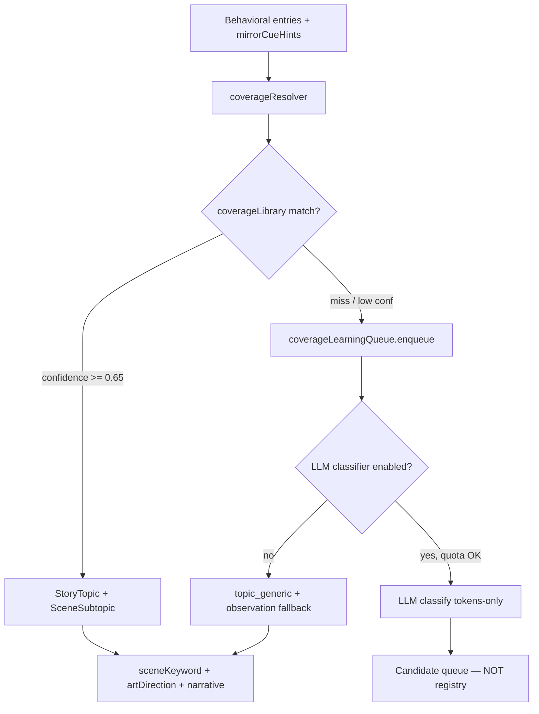
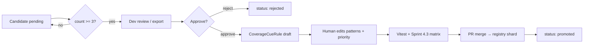

# EZA Daily Mirror — P5.1 Topic Coverage Library (Tasarım)

**Durum:** Onaylı tasarım spec (May 2026)  
**Kapsam:** `eza-v5/frontend/lib/eza/mirror/` — registry-first topic/subtopic kapsamı  
**Önceki sprint:** P4-F scene quality, Sprint 4.3 Visual QA (162 senaryo, Mardin/İspanya/Tonoz gap’leri)  
**Uygulama:** Aşama 5.2+ (bu doküman kod değiştirmez)

---

## 1. Problem özeti

Mirror pipeline whitelist cue + subtopic resolver ile çalışıyor. Yeni konularda sistem `topic_generic` ve narrative fallback’e düşüyor (ör. Mardin → `topic_generic` + **İç Yolculuk**; İspanya → `travel_generic_journey`).

**Hedef:** Büyük ama kontrollü bir topic/subtopic/cue kütüphanesi ile registry-first çözüm; generic düşüş oranını minimize etmek.

**Altın kurallar:**

1. Önce registry/cue kütüphanesi çalışır.
2. Eşleşme bulunursa LLM kullanılmaz.
3. Eşleşme yoksa ileride LLM classifier devreye girer (opsiyonel, flag off).
4. LLM sonucu doğrudan registry’ye yazılmaz.
5. Candidate queue’ya düşer.
6. Eşik ve insan onayı sonrası registry’ye eklenir.

---

## 2. Mimari diyagram

### Mevcut durum (P4 / Sprint 4.x)

```
userText
  → extractStoryCueTokens()     → mirrorCueHints[] (token only, raw chat yok)
  → resolveStoryTopics()        → storyTopicCueRegistry + observation fallback
  → resolveSceneSubtopics()     → sceneSubtopicCueRegistry (4 topic resolver)
  → sceneKeywordRegistry / artDirectionRegistry / narrativeAlignmentEngine
```

### Hedef mimari (P5.x)



### Modül sorumlulukları

| Modül | Rol |
|-------|-----|
| `coverageLibrary.ts` | Tek kaynak: topic cues, subtopic cues, gruplar, öncelik, minHits |
| `coverageSynonyms.ts` | TR/EN normalizasyon, alias, diacritic folding (match-only) |
| `coverageCandidateTypes.ts` | Candidate, promotion draft, fingerprint tipleri |
| `coverageResolver.ts` | Unified resolve; mevcut resolver’ları sarmalar |
| `coverageLearningQueue.ts` | Miss/low-conf toplama, dedup, export; inference’a bağlanmaz |

**Entegrasyon noktası (5.2):** `visualPromptEngine.ts` içindeki `resolveStoryTopics` + `resolveSceneSubtopics` → `resolveCoverage()`.

**AGENTS.md:** Yalnızca mirror FE; backend passive learning infra inference’a bağlanmaz; raw chat / PII saklanmaz.

---

## 3. StoryTopicId ve SceneSubtopicId genişletme

### StoryTopicId — sabit

Mevcut 11 topic değişmez:

`vehicle` · `travel` · `architecture` · `technology_ai` · `finance` · `health` · `food_culture` · `family` · `education` · `spiritual_reflection` · `general_curiosity`

Kaynak: `eza-v5/frontend/lib/eza/mirror/storyTopicTypes.ts`

### SceneSubtopicId — isimlendirme konvansiyonu

```
{domain}_{entity}           travel_spain, arch_mardin_stone
{domain}_{theme}            travel_train_journey, health_sleep_rhythm
{domain}_{comparison}       vehicle_ev_comparison (mevcut)
{domain}_{craft}            arch_material_study (mevcut)
{domain}_generic_{theme}    finance_budget_planning
topic_generic               global fallback (korunur)
```

**Hedef:** ~280–320 subtopic ID. Union type 300+ ID’de sürdürülemez; Aşama 5.2’de branded string + build-time registry validation.

### Downstream zorunluluk (üçlü kayıt)

Her yeni `SceneSubtopicId` için:

1. `sceneKeywordRegistry` — sceneKeywords + environment
2. `artDirectionRegistry` — lighting / lens / mood
3. `narrativeAlignmentEngine` — headline + quote

Eksik kayıt → test-time fail (5.2 gate).

---

## 4. CoverageLibrary yapısı

### Hiyerarşi

```
CoverageLibrary
├── version: "5.2.0"
├── globalLimits (MAX_CUE_TOKEN_LENGTH, per-turn, aggregate)
├── topicRules[]          → StoryTopicId (~120–150 canonical token)
├── subtopicRules[]       → SceneSubtopicId (~180–220 canonical token)
├── subtopicGroups[]      → resolver scoring grupları
└── conflictRules[]       → öncelik çözümü (tonoz vs kubbe)
```

### Dosya organizasyonu (logical shards)

```
eza-v5/frontend/lib/eza/mirror/coverage/
  coverageLibrary.ts          # merge + public API
  shards/
    travel.coverage.ts
    architecture.coverage.ts
    vehicle.coverage.ts
    technology_ai.coverage.ts
    finance.coverage.ts
    health.coverage.ts
    food_culture.coverage.ts
    family.coverage.ts
    education.coverage.ts
    spiritual_reflection.coverage.ts
  coverageSynonyms.ts
  coverageConflictRules.ts
  coverageCandidateTypes.ts
  coverageResolver.ts
  coverageLearningQueue.ts
```

### Kayıt şeması

```typescript
type CoverageCueRule = {
  token: string;                    // canonical, max 24 char
  topic: StoryTopicId;
  subtopic?: SceneSubtopicId;
  patterns: readonly string[];
  synonymGroupId?: string;
  priority: number;                 // yüksek = önce (city > generic journey)
  minHits?: number;
  extractPhase: 'topic' | 'subtopic' | 'both';
};
```

### Boyut hedefi

| Katman | Adet |
|--------|------|
| Canonical cue token | ~350–420 |
| Pattern varyantı (TR/EN) | ~500–650 |
| SceneSubtopicId | ~280–320 |
| Subtopic group | ~80–100 |

### İlk domain kapsamı (özet)

| Domain | Subtopic (hedef) | Cue (hedef) | Not |
|--------|------------------|-------------|-----|
| travel | ~52 | ~88 | İspanya, Türkiye şehirleri; Mardin → arch |
| architecture | ~48 | ~78 | Mardin stone, tonoz conflict fix |
| vehicle | ~28 | ~52 | Mevcut 3 comparison + marka genişlemesi |
| technology_ai | ~38 | ~62 | Mevcut + cloud, security, devops |
| finance | ~26 | ~42 | Yeni resolver (5.2) |
| health | ~26 | ~40 | Yeni resolver |
| food_culture | ~32 | ~48 | Yeni resolver |
| family | ~22 | ~35 | Yeni resolver |
| education | ~22 | ~32 | Yeni resolver |
| spiritual_reflection | ~18 | ~28 | Yeni resolver |

### Sprint 4.3 gap fix’leri (conflict rules)

| Senaryo | Mevcut | Hedef |
|---------|--------|-------|
| Mardin | `topic_generic` | `arch_mardin_stone` (mimari heritage) |
| İspanya | `travel_generic_journey` | `travel_spain` |
| Tonoz (tek) | `arch_mosque_heritage` (kubbe önceliği) | `arch_vault_study` |
| Tonoz + kubbe | mosque | `arch_mosque_heritage` |

---

## 5. Synonym layer (`coverageSynonyms.ts`)

### Üretim yolu — fuzzy yok

| Tier | Yöntem |
|------|--------|
| T0 | Exact pattern `includes` / word boundary (mevcut `matchRule`) |
| T1 | Synonym alias → canonical token |
| T2 | Diacritic-folded match (fold sadece eşleşme; canonical değişmez) |
| T3 | Longest-pattern-first sort (mevcut) |

**Üretimde Levenshtein kullanılmaz** — false positive riski.

### Candidate-only fuzzy (review)

- Token uzunluğu ≥ 5, Levenshtein ≤ 1
- Yalnızca `nearMissCanonical` önerisi; registry’ye otomatik yazılmaz

### Synonym grup şeması

```typescript
type SynonymGroup = {
  id: string;
  canonical: string;
  variants: readonly string[];
  locale?: 'tr' | 'en' | 'both';
};
```

### TR/EN normalizasyon pipeline

```
raw text
  → trim + lowercase (tr-TR locale)
  → NFKC unicode normalize
  → punctuation → space
  → collapse whitespace
  → wrap with spaces (mevcut normalizeText)
```

`mirrorCueHints` her zaman **canonical token** saklar.

---

## 6. CoverageResolver

### API (5.2)

```typescript
function resolveCoverage(entries: SavedBehavioralEntry[]): CoverageResolution;
```

### Akış

1. Aggregate `mirrorCueHints` (mevcut limitler: 8/turn, 12 aggregate).
2. `matchCoverageLibrary(tokens)` → topic + subtopic + confidence.
3. Confidence ≥ `REGISTRY_CONFIDENCE_MIN` (0.65) → döndür, LLM yok.
4. Miss / low conf → `coverageLearningQueue.enqueue()`.
5. LLM flag off veya quota aşımı → observation fallback + `topic_generic` gerekirse.
6. Downstream: `buildMasterPosterText`, `buildMirrorVisualFromContext` değişmez (sadece input kalitesi artar).

### Mevcut resolver ile geçiş

Aşama 5.2’de `coverageResolver` içinden `resolveStoryTopics` / `resolveSceneSubtopics` thin delegate; test geriye uyumluluk korunur.

---

## 7. Candidate Queue modeli

### Temel model

```typescript
type CoverageCandidateStatus =
  | 'pending_review'
  | 'approved'
  | 'rejected'
  | 'promoted';

type CoverageCandidateSource =
  | 'registry_miss'
  | 'low_confidence'
  | 'llm_fallback';

type CoverageCandidate = {
  id: string;
  fingerprint: string;                 // dedup key
  normalizedCueTokens: string[];
  suggestedTopic: StoryTopicId;
  suggestedSubtopic: SceneSubtopicId | 'topic_generic';
  confidence: number;
  count: number;
  firstSeenAt: string;
  lastSeenAt: string;
  source: CoverageCandidateSource;
  status: CoverageCandidateStatus;

  // extensions
  observationCategory?: string;
  intentKeywords?: string[];
  nearMissCanonical?: string;
  conflictWith?: string[];
  reviewedAt?: string;
  reviewedBy?: 'human' | 'system';
  rejectionReason?: string;
  promotionDraftId?: string;
};
```

### Fingerprint (PII-safe)

```
fingerprint = sha256(
  sorted(normalizedCueTokens).join('|') +
  primaryTopic +
  primarySubtopic
)
```

### Tetikleyiciler

| source | Koşul |
|--------|-------|
| `registry_miss` | Topic confidence < 0.35 veya subtopic = `topic_generic` (topic ≠ general_curiosity) |
| `low_confidence` | Subtopic confidence ∈ [0.35, 0.65) |
| `llm_fallback` | LLM önerisi (ileride); registry’ye yazılmaz |

### Queue operasyonları

| Op | Açıklama |
|----|----------|
| `upsert(candidate)` | fingerprint dedup, count++, lastSeenAt |
| `listPending(minCount)` | count ≥ 3 önce (gürültü filtresi) |
| `approve(id)` | promotion draft üretir; registry’ye yazmaz |
| `reject(id, reason)` | 90 gün aynı fingerprint suppress |
| `exportForReview()` | dev JSON / CSV |

### Depolama (5.2–5.3)

- **FE-only:** localStorage / IndexedDB
- **Review UI:** `/dev/mirror-coverage` (QA-only, production route değil)
- Cross-user aggregate → Aşama 5.4 (onaylı backend, anonymized)

---

## 8. Promotion kuralları



1. LLM çıktısı **asla** otomatik promote edilmez.
2. Onaylı cue: subtopic ID, ≥2 pattern (TR+EN), priority, conflict rule zorunlu.
3. Yeni subtopic → sceneKeyword + artDirection + headline aynı PR’da.
4. `count >= 3` veya manuel gap sprint ekleme.
5. Reject → 90 gün fingerprint suppress.

---

## 9. LLM fallback fazı

### Konum

`coverageResolver.ts` — registry miss sonrası, feature flag ile.

### Feature flag

`MIRROR_COVERAGE_LLM_CLASSIFIER=false` (default off)

### LLM input (tokens-only)

- Max 12 canonical cue token
- Observation category ID
- Intent whitelist keyword’leri
- **Asla:** raw chat, kullanıcı adı, transcript

### LLM output

```typescript
{
  suggestedTopic: StoryTopicId;
  suggestedSubtopic: SceneSubtopicId | 'topic_generic';
  confidence: number;
  rationaleCode: string;  // enum, serbest metin değil
}
```

Output → candidate queue only; production blend düşük confidence ile observation fallback.

### Günlük quota (öneri)

- Max **3** call / user / day
- Global max **500** call / day

---

## 10. Privacy kuralları

| İzinli | Yasak |
|--------|-------|
| `mirrorCueHints` canonical token | Raw kullanıcı mesajı |
| Observation category ID | Email, telefon, isim |
| Intent vector whitelist match | Tam cümle / transcript |
| Candidate fingerprint (hash) | LLM rationale serbest metin (sadece enum) |
| Aggregate count / timestamps | Kişisel veri saklama |

Mevcut akış: `StandaloneChatInner.tsx` → `extractStoryCueTokens(text)` → yalnızca token persist.

Backend `LEARNING_INFRASTRUCTURE_README.md` passive learning kuralları geçerli — inference otomatik öğrenmez.

---

## 11. Maliyet modeli

| Yol | Maliyet |
|-----|---------|
| Registry hit (hedef ≥85%) | $0 |
| Observation fallback | $0 |
| LLM classifier (tokens-only, mini class) | ~$0.00005–0.0002 / call |
| Image generation | Değişmez (mevcut scene API) |

**Kontrol sırası:** registry genişlet → synonym → observation fallback → LLM (son çare).

**Örnek (10k DAU, %15 miss, quota):** ~500 LLM call/gün → ~$0.10–0.50/gün (sınıflandırma only).

---

## 12. Riskler

| Risk | Mitigasyon |
|------|------------|
| Registry şişmesi | Domain shard; dedup patterns |
| False positive cue | Fuzzy yok; priority + conflict rules |
| Token çakışması | `coverageConflictRules.ts` |
| Subtopic ID patlaması | Üçlü kayıt test gate |
| FE-only queue | 5.4 anonymized aggregate (onaylı) |
| LLM drift | Auto-promote yasak |
| Bundle artışı | Hedef <40KB gzip (5.2) |

---

## 13. Roadmap — Aşama 5.2, 5.3, 5.4

### Aşama 5.2 — Foundation + Resolver (implementation)

1. `coverageCandidateTypes.ts`, `coverageSynonyms.ts`
2. Shard migrate: mevcut `storyTopicCueRegistry` + `sceneSubtopicCueRegistry`
3. `coverageLibrary.ts`, `coverageConflictRules.ts` (Mardin, İspanya, Tonoz)
4. `coverageResolver.ts` → `visualPromptEngine` entegrasyonu
5. Vitest: mevcut resolver testleri + Sprint 4.3 matrisi regression
6. Finance, health, food, family, education, spiritual subtopic resolver’ları (min 15/subtopic domain başına üçlü kayıt)

**Başarı kriterleri:**

- Registry hit ≥ **85%**
- Sprint 4.3 matrisinde Mardin / İspanya / Tonoz → **0 generic**
- `topic_generic` oranı < **10%** (non–general_curiosity)
- Bundle artışı < **40KB** gzip

### Aşama 5.3 — Learning queue + dev review

1. `coverageLearningQueue.ts` — localStorage / IndexedDB
2. `/dev/mirror-coverage` — pending list, export CSV
3. Promotion draft generator (registry’ye otomatik yazmaz)
4. Feature flag: queue on, LLM off

### Aşama 5.4 — Opsiyonel scale (onay gerekir)

1. Anonymized cross-user candidate aggregate (backend endpoint — explicit approval)
2. LLM classifier endpoint (default off)
3. Maliyet telemetry (hit rate, call count)
4. Haftalık human review ritmi

---

## 14. İlgili dosyalar (mevcut kod)

| Dosya | Rol |
|-------|-----|
| `lib/eza/mirror/storyTopicTypes.ts` | StoryTopicId |
| `lib/eza/mirror/sceneSubtopicTypes.ts` | SceneSubtopicId |
| `lib/eza/mirror/storyTopicCueRegistry.ts` | Topic cue whitelist |
| `lib/eza/mirror/sceneSubtopicCueRegistry.ts` | Subtopic groups |
| `lib/eza/mirror/storyTopicResolver.ts` | Topic resolve + extract |
| `lib/eza/mirror/sceneSubtopicResolver.ts` | Subtopic resolve |
| `lib/eza/mirror/sceneKeywordRegistry.ts` | Scene keywords |
| `lib/eza/mirror/artDirectionRegistry.ts` | Art direction |
| `lib/eza/mirror/narrativeAlignmentEngine.ts` | Headline / quote |
| `lib/eza/mirror/visualPromptEngine.ts` | Pipeline entegrasyon noktası |
| `reports/sprint-4.3-visual-qa/` | QA baseline |

---

*Onay: May 2026. Uygulama: `feat(mirror): P5.2 topic coverage library foundation` (ayrı sprint).*
